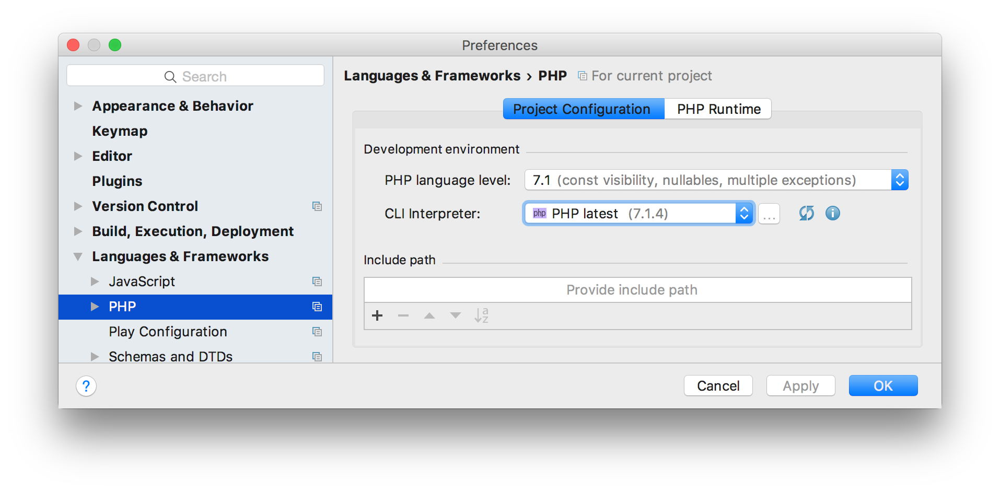

# idea-php-latest-plugin

The plugin brings the latest stable version of the PHP interpreter to PhpStorm or IntelliJ IDEA with the PHP plugin.
The Xdebug extension is bundled and enabled by default. At the moment only macOS and Linux are supported.

